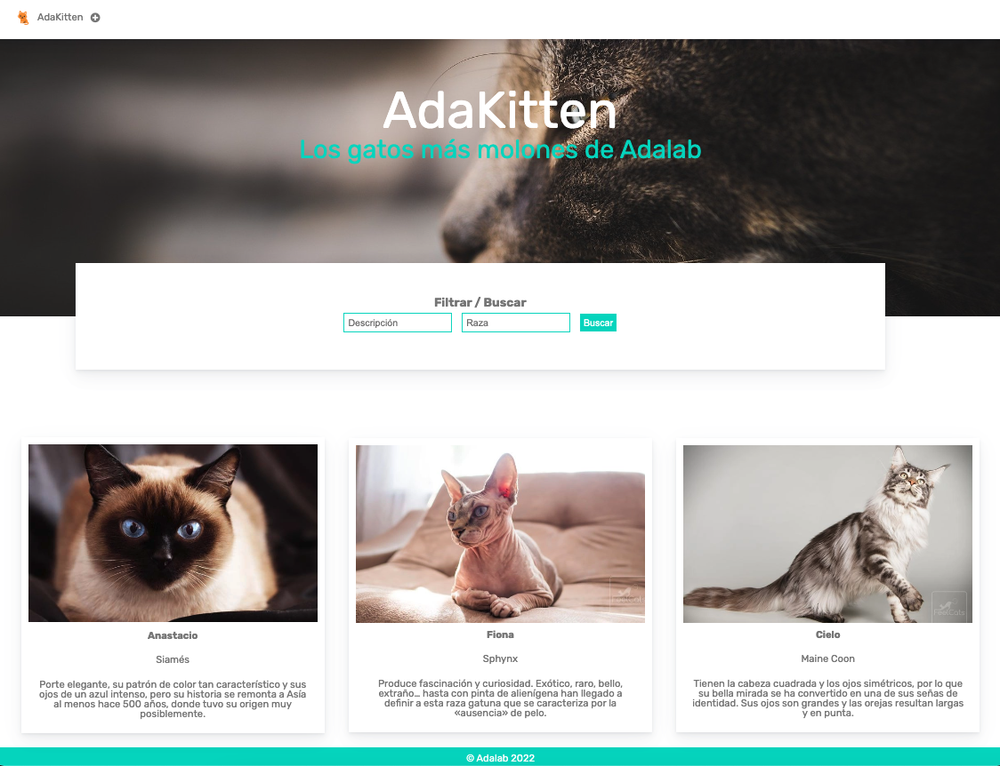

# Ejercicio AdaKitten

Este ejercicio es incremental, es decir, cada día se va añadiendo nuevas funcionalidades.

- En estos materiales esta el enunciado de las tareas que hay que hacer cada día.
- Con trucos y buenas prácticas.

# Aplicación AdaKitten 🐈

¿A quién no le gustan los gatitos 🐈? Las mascotas forman parte de nuestra vida, son nuestra familia, compañeros de trabajo, y seguro que ahora mismo muchas de nosotras tenemos uno o varios a nuestro lado.
Os proponemos trabajar en AdaKitten🐈, una aplicación donde guardamos la información de gatitos. ¿Te apuntas a programar desde cero esta aplicación?

### Descripción de la aplicación

El objetivo de la aplicación es guardar información general sobre gatos. Esta aplicación es replicable y extensible a cualquier temática: perros, listado de productos, contactos.

La aplicación está compuesta por una única página que contiene:

1. Una cabecera que contiene una sección para buscar por un nombre, raza o alguna característica.

2. La sección principal es un listado en forma de tarjetas donde se muestra la información de los gatitos: foto, nombre, raza, y una descripción para contar lo que hace único a cada gato.

3. Por último, podemos añadir nuevos gatitos pulsando sobre el botón "+" que mostrará un formulario para rellenar los datos.

## Qué vas hacer cada día

#### 2.1 Intro a la programación:

- [x] 1. Crea el proyecto
- [ ] 2. Entiende el código html y css del proyecto
- [ ] 3. **LISTADO:** Listado: Mostrar gatitos desde JS

#### 2.2 Intro a la programación 2:

- [ ] 1. **LISTADO:** Mejora como se guarda la información
- [ ] 2. **LISTADO - Bonus:** Nombre de gatitos en mayúsculas

#### 2.3 Condicionales:

- [ ] 1. **FILTRAR:** Búsqueda por descripción.
- [ ] 2. **LISTADO - Bonus:**: ¿Y si no hay raza?.

#### 2.4 Eventos:

- [ ] 1. **FORMULARIO:** Adicionar nuevo gatito.
- [ ] 2. **FORMULARIO:** Cancelar formulario.

#### 2.5 Funciones I:

- [ ] 1. **FORMULARIO:** Mostrar/ocultar el formulario.
- [ ] 2. **FORMULARIO:** Adicionar nuevo gatito.
- [ ] 3. **LISTADO:** Crear el gatito en HTML

#### 2.6 Funciones II:

- [ ] 1. **FILTRAR:** Filtrar por descripción.
- [ ] 2. **LISTADO - Bonus:**: ¿Y si no hay raza?.
- [ ] 3. **BONUS:** Funciones dentro de funciones.
- [ ] 4. **FORMULARIO - Bonus::** Cancelar formulario.

#### 2.7 Objetos

- [ ] 1. **LISTADO:** Convertir cada gatito en un objeto

#### 2.8 Arrays

- [ ] 1. **LISTADO:** Crear listado de gatitos I

#### 2.9 Bucles

- [ ] 1. **LISTADO:** Crear listado de gatitos II
- [ ] 2. **FILTRAR:**: Filtrar por descripción

#### 2.11 Arrays II

- [ ] 1. Conoce el trabajo de tu pareja
- [ ] 2. **FORMULARIO:** Agregar un nuevo gatito al listado

#### 2.12 Métodos funcionales de arrays

- [ ] 1. **FILTRAR:** Filtrar por descripción
- [ ] 2. **FILTRAR:** Filtrar por descripción y por raza

#### 2.13 Peticiones al servidor I

- [ ] 1. **LISTADO:** Obtener listado de gatitos desde el servidor

#### 2.14 Peticiones al servidor II

- [ ] 1. **LISTADO:** Guardar en el local storage
- [ ] 1. **BONUS - FORMULARIO:** Crear un nuevo gatito en el servidor

#### 2.15 DOM Avanzado

- [ ] 1. **LISTADO:** Cambiar a DOM Avanzado